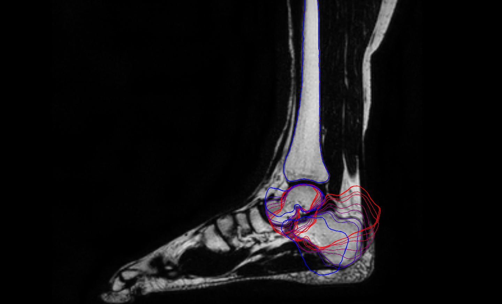

# Invention Disclosure

## Title of the invention
Visualization and interactive adaptation of 3D positioning using 2D X-ray images
 
## Inventors
Daniel Bystrov (daniel.bystrov@philips.com)\
Sven Krönke (sven.kroenke@philips.com)\
Matthias Brück (matthias.brueck@philips.com)\
André Gooßen (andre.goossen@philips.com)\
Jens von Berg (jens.von.berg@philips.com)\
Stewart Young (stewart.young@philips.com)

## Abstract of the invention
In this Invention disclosure we propose a visualization and
interaction technology for the positioning of a 3D model given a 2D 
X-ray image.

Positioning a 3D surface model in a 3D image is a standard and well known procedure. Positioning of a 3D surface model given one or multiple RGB images 

Estimating the 3D pose of a patient given a 2D X-ray image is
a complicated task. This is done when a radiologist inspects
and evaluates a radiograph. To automatically check whether a 
radiography meets the necessary quality standards, the patient's pose 
must be checked automatically – preferably with AI technology with e.g.
a neural network, which estimates 3D poses from radiographs. For the
training of such a network one needs groundtruth poses of internal
anatomical stuctures like bones, ligaments etc. for given X-rays.With
the technology described here, such groundtruth can be generated.
Furthermore, the technology might also be used as a teaching device for
medical students or trainees to visualize the effect of the positioning
on the final radiographs. 


There are many applications, where positioning of a 3D models given X-ray images are required and can be applied in future products: E.g. automatic quality checking of radiographs or in the context of educating medical students or trainees to visualize the effect of the positioning on the final radiographs.

## Keywords related to the invention
Interactive visualization, 3D pose estimation, X-ray imaging

